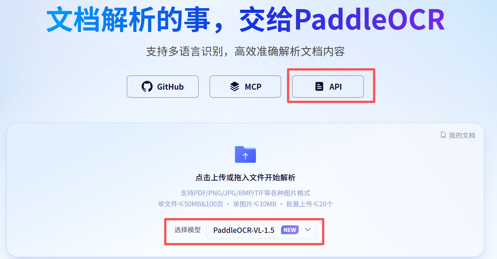
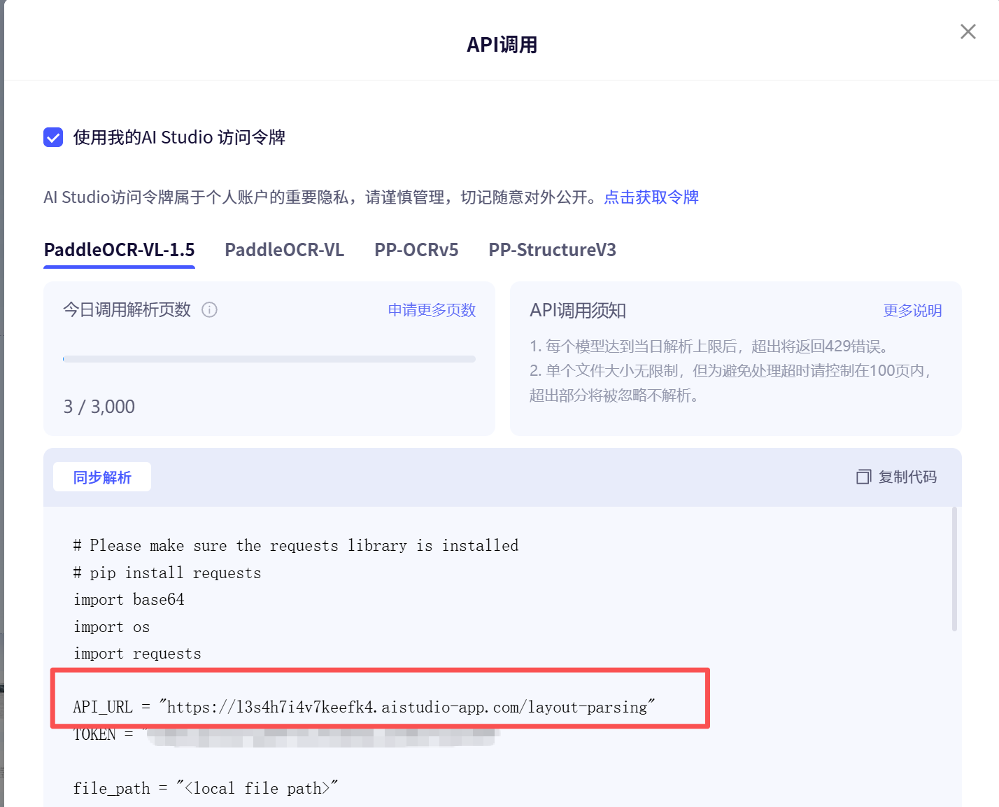

# PaddleOCR-VL

基于百度飞桨 PaddleOCR-VL-1.5 的文档识别工具，支持 PDF/PNG/JPG/BMP/TIF 等格式的 OCR 识别，输出 Markdown 格式结果。

## 功能特点

- **多格式支持**：PDF、PNG、JPG、JPEG、BMP、TIF、TIFF
- **智能识别**：支持文字、表格、公式、图表识别
- **版面分析**：自动检测文档版面，智能排序
- **多种模式**：快速、标准、精细三种预设模式
- **中文配置**：友好的中文配置文件

## 快速开始

### 安装依赖

```bash
pip install -r requirements.txt
```

### 配置 Token

1. 访问 [百度 AI Studio](https://aistudio.baidu.com/account/accessToken) 申请访问令牌
2. 创建 `scripts/.env` 文件并设置 Token：

```bash
cp scripts/.env.example scripts/.env
```

3. 编辑 `scripts/.env`，填入您的 Token：

```bash
PADDLEOCR_TOKEN=your_api_token_here
```

### 配置 API URL

每个用户都有专属的 API URL，需要从 AI Studio 获取：

1. 访问 [百度 AI Studio - PaddleOCR 任务页](https://aistudio.baidu.com/paddleocr/task)

2. 点击页面上的 **"API"** 按钮：



3. 在弹出的 API 调用窗口中：
   - 选择模型（推荐 `PaddleOCR-VL-1.5`）
   - 复制代码中的 `API_URL` 值



4. 将获取的 URL 填入 `scripts/.env` 文件：

```bash
PADDLEOCR_API_URL=https://xxxxxxxx.aistudio-app.com/layout-parsing
```

### 使用方法

```bash
# 使用标准模式识别（默认）
python scripts/paddleocr_vl.py document.pdf

# 使用精细模式
python scripts/paddleocr_vl.py document.pdf --mode 精细

# 批量处理
python scripts/paddleocr_vl.py file1.pdf file2.jpg --mode 标准
```

## 预设模式

| 模式 | 特点 | 适用场景 |
|------|------|----------|
| 快速 | 处理速度最快 | 简单文档、纯文本 |
| 标准 | 平衡速度与精度 | 大多数场景（推荐） |
| 精细 | 最高精度 | 复杂文档、包含表格/图表/公式 |

## 目录结构

```
paddleocr-vl/
├── scripts/
│   ├── config.yaml          # 配置文件
│   ├── config_loader.py     # 配置加载器
│   ├── paddleocr_vl.py      # 主脚本
│   ├── .env.example         # 环境变量模板
│   └── .env                 # 环境变量配置（需自行创建）
├── references/
│   └── config-guide.md      # 详细配置指南
└── README.md
```

## 常见问题

**Q: 识别结果不准确怎么办？**
A: 尝试使用"精细"模式，或在 `config.yaml` 中调整相关参数。

**Q: 如何处理跨页表格？**
A: 使用"精细"模式，会自动启用 `merge_tables` 功能合并跨页表格。

**Q: 支持哪些文件格式？**
A: 支持 PDF、PNG、JPG、JPEG、BMP、TIF、TIFF 格式。

## 详细配置

更多参数配置请参考 [详细配置指南](references/config-guide.md)。

## 许可证

MIT License
